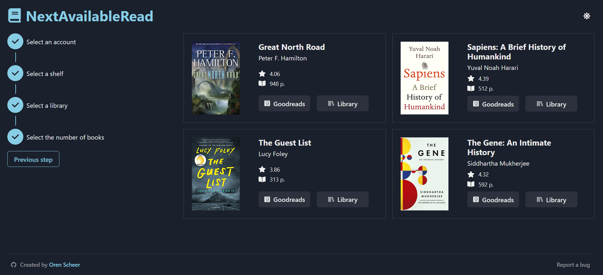

# NextAvailableRead
Find books from your Goodreads shelves that are currently available for checkout as e-books at one of over 130 public libraries in Canada, the United States, Australia, and New Zealand.

App built with TypeScript, React, and Node.js.

Deployed using Render and Netlify to [nextavailableread.orenscheer.com](https://nextavailableread.orenscheer.com).

